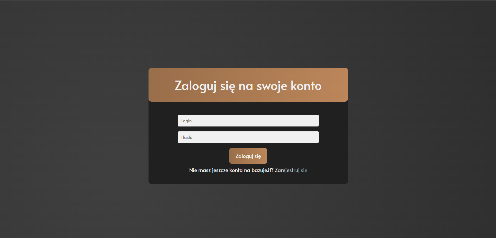
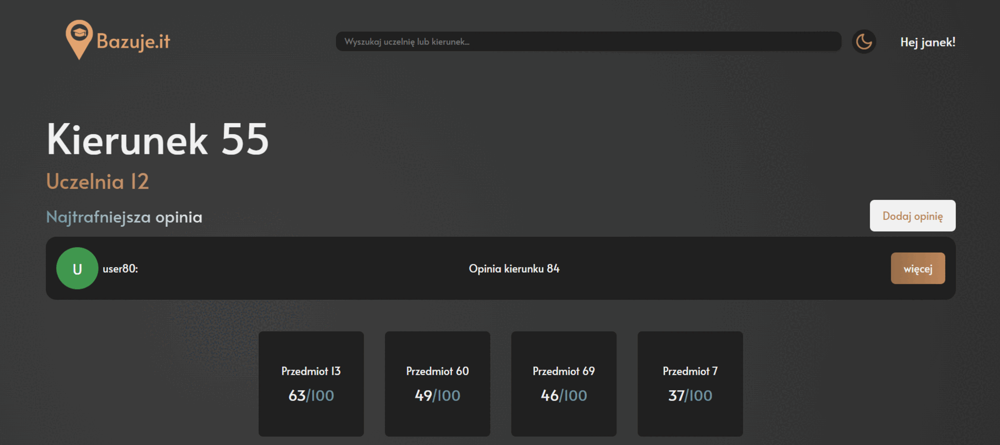
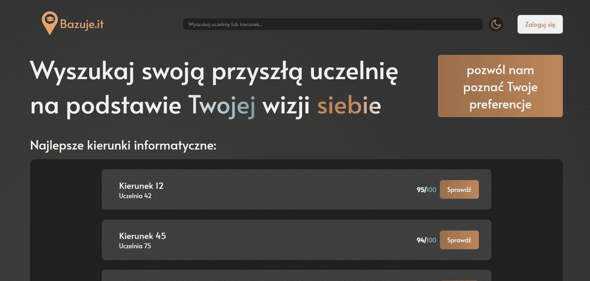

# Bazuje.it

## Application Description

### Overview

The web application serves two primary functions. It provides a space for high school students to explore which computer science-related field of study best suits them and a platform for university students to share their experiences. High school students have access to all CS-related majors in Poland and a survey that helps match them with the most suitable options. Meanwhile, university students, after logging in, can share their opinions and rate the reviews of their peers.

### Backend

The backend of the project is built with Django and provides an API for managing user data, reviews, and information about study programs.

### Frontend

The frontend is built with React and provides a user interface for browsing and adding reviews about study programs and universities.

### Features

-   User registration and login
-   Browsing top study programs
-   Adding and editing reviews about study programs
-   Searching for study programs and universities

## Look into the application

### User Login and Registration



### Adding an Opinion



### Taking a survey



## Prerequisites

Before you begin, ensure you have the following software installed:

-   [Python 3.9](https://www.python.org/downloads/release/python-396/)
-   [Node.js](https://nodejs.org/) (recommended version 20.x)
-   [npm](https://www.npmjs.com/get-npm) (usually installed with Node.js)
-   [Django](https://www.djangoproject.com/)

## Backend Installation

1. Clone the repository:

    ```sh
    git clone https://github.com/giro39/bazuje.it.git
    cd bazuje.pl/backend
    ```

2. Create and activate a virtual environment:

    ```sh
    python -m venv venv
    source venv/bin/activate  # On Windows: venv\Scripts\activate
    ```

3. Install the required dependencies:

    ```sh
    pip install -r requirements.txt
    ```

4. Run database migrations:

    ```sh
    python manage.py makemigrations
    python manage.py migrate
    ```

5. Start the development server:
    ```sh
    python manage.py runserver
    ```

## Frontend Installation

1. Navigate to the frontend directory:

    ```sh
    cd ../frontend
    ```

2. Install dependencies:

    ```sh
    npm install
    ```

3. Start the application:
    ```sh
    npm start
    ```

## Final Notes

After starting both servers, the application should be accessible at `http://localhost:5173`. The backend will run on port `8000`.
